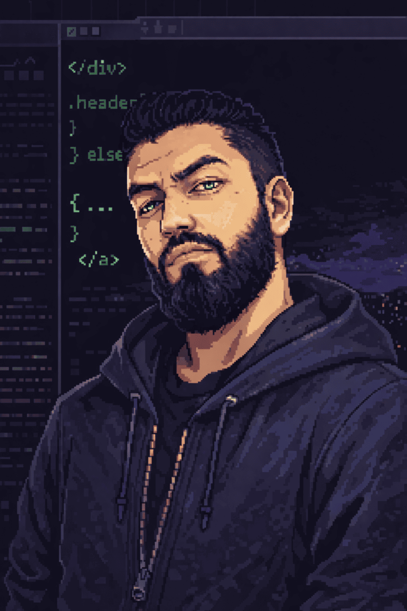

---

<table align="center" width="100%" style="border-collapse: collapse; max-width: 900px;">
<tr>
<td width="40%" align="center" style="vertical-align: middle; padding: 20px;">

  
<h2 style="color: #e6edf3; margin: 10px 0;">Juan E. Arguello</h2>

Software Engineering Student

📍 Colombia

</td>

<td width="60%" style="vertical-align: middle; padding: 20px;">

## 🏆 GitHub Stats

</td>
</tr>
</table>

---

## 💬 About Me

- 👨‍💻 Currently finishing my **Software Engineering** degree
- 📊 **Data Analyst** | Transforming data into insights
- 🌱 Passionate programmer since childhood - that dream is now reality
- 💬 Ask me anything! I love to help and share knowledge
- 🎯 Building cool things, one commit at a time

---

## 🛠️ Tech Stack

<table align="center">
<tr>
<td align="center" style="padding: 15px;">

  
<b>Python</b>
</td>
<td align="center" style="padding: 15px;">

  
<b>JavaScript</b>
</td>
<td align="center" style="padding: 15px;">

  
<b>Java</b>
</td>
<td align="center" style="padding: 15px;">

  
<b>MySQL</b>
</td>
<td align="center" style="padding: 15px;">

  
<b>HTML5</b>
</td>
<td align="center" style="padding: 15px;">

  
<b>CSS3</b>
</td>
</tr>
</table>

---

## 🚀 Featured Projects

| Project | Description | Language |
|---------|-------------|----------|
| 📊 Portfolio | My personal data analyst portfolio | JavaScript, HTML, CSS |
| 🔧 Project Name | Coming soon... | Python |
| 🎯 Project Name | Coming soon... | Java |

---

## 📈 GitHub Activity

---

## 📱 Let's Connect

<table align="center">
<tr>
<td align="center" style="padding: 10px;">

</td>
<td align="center" style="padding: 10px;">

</td>
<td align="center" style="padding: 10px;">

</td>
<td align="center" style="padding: 10px;">

</td>
<td align="center" style="padding: 10px;">

</td>
</tr>
</table>

---

---

✨ **MastaDev** | Last updated: April 2026

